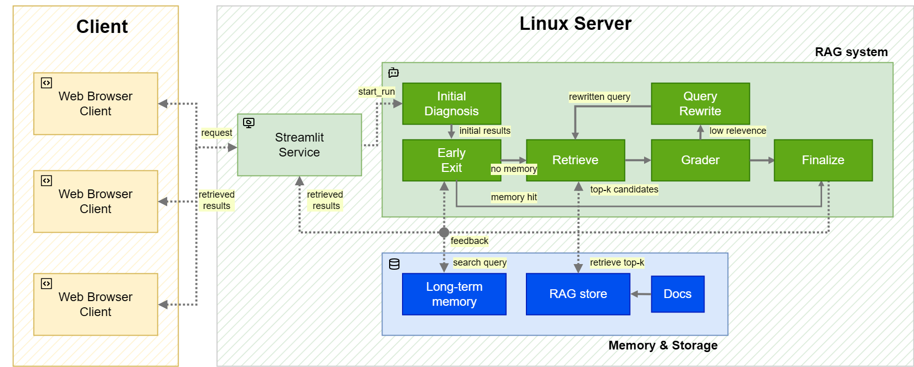
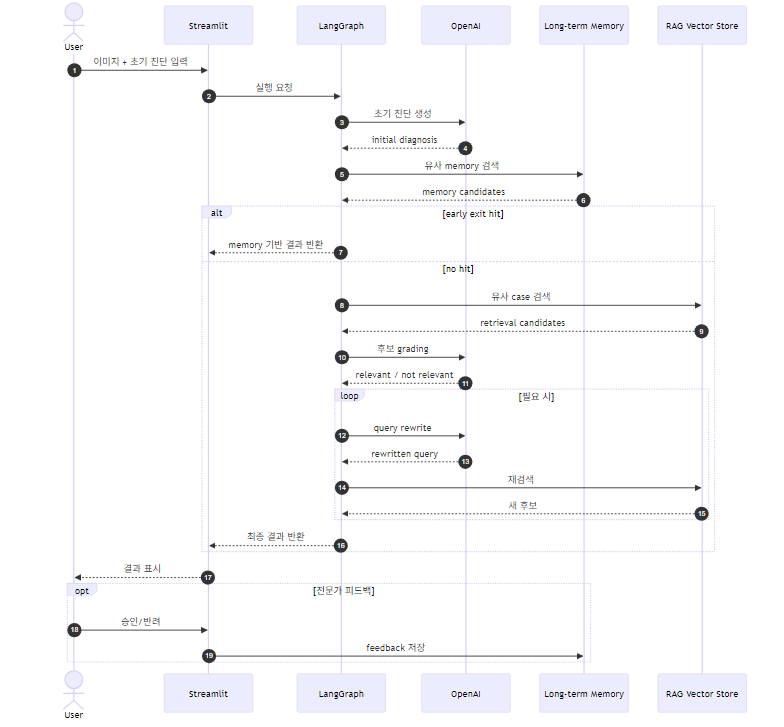

# LangGraph 기반 Long-Term Memory 결합형 Multimodal RAG 시스템

> 과거 접근성 진단 이력을 멀티모달로 검색하고, 검증된 사례를 재사용하며, 전문가 피드백을 장기 기억으로 축적하는 Agentic RAG 시스템

## TL;DR

이 프로젝트는 **접근성 진단 업무의 검색 비용과 진단자 간 편차**를 줄이기 위해 만든 **Long-Term Memory 결합형 Multimodal RAG 시스템**입니다.  
현재 입력된 오류 이미지와 초기 진단 메모를 바탕으로 1차 진단을 만든 뒤, 과거 진단 이력에서 유사 사례를 검색하고, LLM grader가 실제 재사용 가능한 후보만 선별합니다. 적합한 사례가 없으면 query rewrite를 통해 검색을 재시도하고, 최종적으로 확정된 결과에 대한 전문가 피드백을 저장해 이후 요청에서 **early exit**로 재사용합니다.

**핵심 효과**
- 유사 사례 상위 노출률 **25~30% 개선**
- 유사 사례 탐색 시간 **약 40% 단축**
- 응답 정확도 **10~15% 향상**
- 사용자 피드백 기반 **RAG 품질 개선 루프** 설계

---

## 1. 프로젝트 개요

### 문제 정의
접근성 진단 업무는 여러 진단자가 협업하는 구조이기 때문에, 동일한 유형의 오류에 대해 **일관된 진단과 개선 가이드**를 제공하는 것이 중요합니다. 하지만 실제 현업에서는 다음 문제가 반복됩니다.

- 과거 진단 이력이 PPTX/PDF 문서에 흩어져 있어 유사 사례 검색에 시간이 많이 듭니다.
- 동일 오류에 대해 진단자마다 표현과 판단이 달라 검수 부담이 커집니다.
- 단순 벡터 유사도만으로는 실제로 재사용 가능한 사례인지 판단하기 어렵습니다.
- 잘 검증된 사례를 다음 요청에서 즉시 재사용할 수 있는 프로젝트 단위 메모리 레이어가 필요합니다.

### 목표
이 프로젝트의 목표는 다음 네 가지입니다.

1. **과거 진단 이력의 멀티모달 검색**
2. **프로젝트 단위 Long-Term Memory 설계**
3. **검색 실패 시 query rewrite를 포함한 Agentic RAG 구성**
4. **전문가 피드백을 활용한 검색 품질 고도화**

### 프로젝트 메타 정보

| 항목 | 내용 |
|---|---|
| 프로젝트명 | LangGraph 기반 Long-Term Memory 결합형 Multimodal RAG 시스템 |
| 성격 | 내부 직원을 위한 인하우스 프로젝트 |
| 기간 | 2026.01.04 ~ 2026.03.01 |
| 인원 | 1명 |
| 기여도 | 100% |
| 역할 | 전체 설계, 파이프라인 구현, 메모리 구조 설계, 품질 개선 루프 설계 |

---

## 2. 주요 기여

### 2.1 Self-reflection 기반 Multimodal RAG 파이프라인
현재 입력 이미지와 초기 진단 메모로부터 구조화된 1차 진단을 생성하고, 이를 기반으로 이미지 채널과 텍스트 채널을 함께 검색합니다.

### 2.2 프로젝트 단위 Long-Term Memory
세션 단위가 아니라 `project_id` 단위로 과거 피드백을 누적합니다.  
동일 프로젝트에서 반복되는 유사 오류는 메모리 검색만으로 바로 재사용할 수 있도록 설계했습니다.

### 2.3 Early Exit 전략
이미 충분히 유사한 검증 사례가 memory에 존재하면 전체 검색 루프를 끝까지 돌지 않고 바로 결과를 반환합니다.  
반복 요청에서 지연과 비용을 줄이는 데 초점을 맞췄습니다.

### 2.4 LLM Grader + Query Rewrite
벡터 유사도가 높아도 실제 진단에 쓸 수 없는 사례가 많기 때문에, grader를 통해 재사용 가능성을 판단합니다.  
관련성이 낮을 경우 rewrite 노드가 검색 질의를 보정해 재검색합니다.

### 2.5 전문가 피드백 기반 품질 개선 루프
최종 결과에 대해 `thumbs_up` / `thumbs_down` 피드백을 저장하고, 이후 memory search 및 early exit 판단에 반영합니다.

---

## 3. 성능 요약

| 지표 | 결과 |
|---|---|
| 유사 사례 상위 노출률 | 25~30% 개선 |
| 유사 사례 탐색 시간 | 약 40% 단축 |
| 응답 정확도 | 10~15% 향상 |
| 추가 성과 | 사용자 피드백 기반 RAG 품질 개선 루프 설계 |

> 이 저장소는 인하우스 프로젝트를 포트폴리오용으로 정리한 코드 스냅샷입니다. 실제 운영 데이터와 일부 내부 부트스트랩 코드는 제외되어 있습니다.

---

## 4. 시스템 아키텍처



아키텍처는 크게 세 영역으로 나뉩니다.

### 4.1 Client Layer
- 사용자는 웹 UI에서 **오류 이미지**와 **초기 진단 메모**를 입력합니다.
- Streamlit이 요청을 받아 LangGraph 파이프라인 실행을 시작합니다.

### 4.2 RAG System Layer
파이프라인은 다음 노드들로 구성됩니다.

- **Initial Diagnosis**: 현재 입력에 대한 1차 구조화 진단 생성
- **Early Exit**: Long-Term Memory에서 재사용 가능한 사례가 있는지 확인
- **Retrieve**: RAG store에서 top-k 후보 검색
- **Grader**: 검색된 후보가 실제로 재사용 가능한지 판정
- **Query Rewrite**: 검색 품질이 낮을 경우 질의 재작성
- **Finalize**: 최종 결과 확정 및 반환

### 4.3 Memory & Storage Layer
- **Long-term memory**: 검증된 진단 결과와 피드백 저장
- **RAG store**: 과거 진단 이력에서 추출한 이미지/텍스트 임베딩 저장
- **Docs**: 원본 PPTX/PDF 기반 과거 진단 문서

---

## 5. 시퀀스 다이어그램



전체 흐름은 다음과 같습니다.

1. 사용자가 **진단 대상 이미지**와 **초기 진단 메모**를 업로드합니다.
2. Streamlit이 LangGraph 실행을 요청합니다.
3. LLM이 현재 입력에 대한 **초기 진단**을 생성합니다.
4. Long-Term Memory에서 **유사 memory**를 먼저 검색합니다.
5. 충분히 유사한 memory가 있으면 **early exit**로 결과를 즉시 확정합니다.
6. 없으면 Vector Store에서 top-k 후보를 검색합니다.
7. grader가 후보 재사용 가능성을 판정합니다.
8. 관련성이 낮으면 query rewrite 후 재검색합니다.
9. 최종 결과를 반환하고, 전문가 피드백이 있으면 memory에 저장합니다.

---

## 6. 왜 이런 설계를 선택했는가

### 6.1 Weighted Fusion
이 프로젝트는 이미지와 텍스트를 같은 비중으로 다루지 않습니다.

- 초기 진단 텍스트는 구조화되기 때문에 텍스트 유사도가 전반적으로 높게 형성될 수 있습니다.
- 실제 유사 사례 검색에서는 **문장의 유사성보다 화면 자체의 유사성**이 더 중요한 경우가 많습니다.
- 그래서 이미지 채널과 텍스트 채널을 분리해 임베딩하고, **이미지 쪽 가중치를 더 강하게 반영하는 weighted fusion**을 사용했습니다.

현재 구현에서는 다음 조합을 사용합니다.

- 이미지 임베딩: `openai/clip-vit-base-patch32`
- 텍스트 임베딩: `sentence-transformers/paraphrase-multilingual-MiniLM-L12-v2`

### 6.2 Agentic RAG
단순 top-k 검색만으로는 실제로 재사용 가능한 사례를 고르기 어렵습니다.

그래서 아래 루프를 사용했습니다.

`initial diagnosis → retrieve → grade → rewrite → retrieve`

이 구조는 “검색 결과가 비슷해 보이지만 실제로는 쓰기 어려운 사례”를 걸러내는 데 목적이 있습니다.

### 6.3 LangGraph
이 프로젝트는 상태 전이와 조건 분기가 많습니다.

- memory early exit
- retrieval
- grader
- rewrite
- 재검색
- finalize
- feedback 저장

이 흐름은 선형 체인보다 **그래프 기반 오케스트레이션**이 더 적합합니다. LangGraph는 각 단계의 상태를 공유하고 조건에 따라 다음 노드를 명확하게 분기할 수 있어서, 검색 파이프라인을 안정적으로 제어하기 좋았습니다.

### 6.4 Long-Term Memory
이 시스템은 채팅형 단기 문맥 유지보다, **프로젝트 단위로 진단 이력과 피드백을 축적하는 외부 메모리 레이어**가 중요합니다.

현재 코드에서는 memory client가 아래 인터페이스를 만족한다고 가정합니다.

- `search(query, user_id, limit)`
- `add(text, user_id, metadata)`

즉, 특정 라이브러리에 종속되기보다 **프로젝트별 메모리 네임스페이스**를 유지할 수 있는 구조를 우선했습니다.

---

## 7. 저장소 구조

```text
.
├── README.md
├── README_COLAB_RUN.md
├── START_HERE.txt
├── app.py
├── requirements.txt
├── golden_text.xlsx
├── golden_text_template.xlsx
├── example_input/
│   ├── README.txt
│   ├── initial_note_example.txt
│   └── test_img.png
├── past_diagnosis_history/
│   ├── README.txt
│   ├── past_diagnosis1.pptx
│   └── past_diagnosis2.pptx
├── rag_system/
│   ├── clients/
│   │   └── openai_responses.py
│   ├── graph/
│   │   └── build_graph.py
│   ├── ingest/
│   │   └── build_case_db.py
│   ├── models/
│   │   └── schemas.py
│   ├── nodes/
│   │   ├── feedback.py
│   │   ├── grader.py
│   │   ├── initial_diagnosis.py
│   │   ├── memory_early_exit.py
│   │   ├── normalize.py
│   │   ├── retrieve.py
│   │   └── rewrite.py
│   └── preprocess/
│       └── a11y_preprocess.py
└── assets/
    ├── architecture.png
    └── sequence_diagram.png
```

---

## 8. 입력과 출력

### 입력
- 현재 진단할 **오류 이미지** 1개 이상
- 현재 상황에 대한 **초기 진단 메모**
- 프로젝트별 과거 진단 이력 문서 (`.pptx`, `.pdf`)

### 전처리 결과
과거 진단 이력을 전처리하면 프로젝트별로 다음 산출물이 생성됩니다.

- `cases.json`
- `vector_store.json`
- `manifest.json`
- `preprocessed/`

### 최종 출력
최종적으로 아래 필드를 갖는 구조화 진단 결과를 반환합니다.

```json
{
  "error_type": "...",
  "check_item": "...",
  "improvement_text": "...",
  "improvement_code": "..."
}
```

---

## 9. 구현 상세

### 9.1 Initial Diagnosis
`rag_system.nodes.initial_diagnosis`

- 현재 이미지와 사용자 메모를 입력받아 1차 진단을 생성합니다.
- `golden_text.xlsx`의 허용 조합을 사용해 `check_item / error_type` 조합을 제한합니다.
- 잘못된 조합이 나오면 허용된 조합으로 fallback합니다.

### 9.2 Memory Early Exit
`rag_system.nodes.memory_early_exit`

- memory에서 프로젝트별 관련 사례를 먼저 찾습니다.
- query image와 memory에 저장된 image 간 유사도를 계산합니다.
- similarity가 threshold 이상이면 전체 검색 루프를 생략하고 결과를 재사용합니다.
- `thumbs_down` 피드백 사례는 early exit에서 제외합니다.

### 9.3 Weighted Retrieval
`rag_system.nodes.retrieve`

- 현재 이미지 임베딩과 질의 텍스트 임베딩을 각각 생성합니다.
- 과거 사례의 이미지/텍스트 임베딩과 비교해 similarity를 계산합니다.
- softmax 기반 가중치로 채널 중요도를 반영해 최종 점수를 산출합니다.

### 9.4 Grader
`rag_system.nodes.grader`

- 높은 유사도만으로는 충분하지 않기 때문에, LLM이 후보 사례의 **실제 재사용 가능성**을 판정합니다.
- top 후보 중 `is_relevant == true`인 사례를 선택합니다.

### 9.5 Query Rewrite
`rag_system.nodes.rewrite`

- 낮은 관련성으로 판단된 후보들의 이유를 참고해 retrieval query를 다시 씁니다.
- 새 진단을 만드는 것이 아니라, **검색에 유리한 질의**를 생성하는 역할만 수행합니다.

### 9.6 Feedback Memory Save
`rag_system.nodes.feedback`

- 최종 결과에 대한 승인/반려를 저장합니다.
- 이후 같은 프로젝트의 유사 오류 검색 시 재사용됩니다.

---

## 10. 빠른 시작

## 10.1 사전 준비

### 환경 요구사항
- Python 3.10+
- OpenAI API Key
- LibreOffice 또는 `soffice` 설치
  - PPTX를 PDF/이미지로 전처리할 때 사용
- 선택 사항: CUDA 환경
  - CLIP 임베딩 계산 속도 향상

### 설치

```bash
git clone <your-repo-url>
cd Agentic_RAG2
pip install -r requirements.txt
```

### 환경 변수

```bash
export OPENAI_API_KEY=YOUR_KEY
export RAG_CASE_STORE_ROOT=./rag_case_store
# 선택 사항
export SOFFICE_PATH=/usr/bin/soffice
export VLM_MODEL=gpt-4.1-mini
export VLM_TEMPERATURE=0.0
export RENDER_DPI=200
```

---

## 10.2 과거 진단 이력 준비

`past_diagnosis_history/` 또는 프로젝트별 폴더에 과거 이력 문서를 넣습니다.

지원 포맷
- `.pptx`
- `.pdf`

예시

```text
./past_diagnosis_history/
├── past_diagnosis1.pptx
└── past_diagnosis2.pptx
```

---

## 10.3 case DB 생성

```bash
python -m rag_system.ingest.build_case_db \
  --project-id demo_project \
  --input-dir ./past_diagnosis_history \
  --case-store-root ./rag_case_store
```

생성 결과

```text
./rag_case_store/demo_project/
├── cases.json
├── vector_store.json
├── manifest.json
└── preprocessed/
```

---

## 10.4 프로그램 방식으로 파이프라인 실행

현재 그래프 빌더는 `rag_system.graph.build_graph.make_graph(...)` 형태의 팩토리로 구현되어 있습니다.  
즉, LLM client와 memory client를 주입하는 부트스트랩 레이어가 필요합니다.

예시:

```python
from rag_system.graph.build_graph import make_graph
from rag_system.clients.openai_responses import OpenAIResponsesJSONClient

# memory_client는 아래 두 메서드를 지원해야 합니다.
# - search(query, user_id, limit)
# - add(text, user_id, metadata)

class YourMemoryClient:
    def search(self, query, user_id, limit=5):
        ...

    def add(self, text, user_id, metadata=None):
        ...

app = make_graph(
    llm_diagnosis=OpenAIResponsesJSONClient(model="gpt-4o-mini"),
    llm_grader=OpenAIResponsesJSONClient(model="gpt-4o-mini"),
    llm_rewriter=OpenAIResponsesJSONClient(model="gpt-4o-mini"),
    memory_client=YourMemoryClient(),
)

state = {
    "project_id": "demo_project",
    "image_path": "./example_input/test_img.png",
    "user_initial_diagnosis": open("./example_input/initial_note_example.txt", "r", encoding="utf-8").read(),
    "allowed_pairs_xlsx_path": "./golden_text.xlsx",
    "allowed_pairs_sheet_name": "Sheet1",
    "top_k": 5,
    "early_exit_threshold": 0.85,
    "max_rewrite_count": 2,
}

for event in app.stream(state):
    print(event)
```

---

## 10.5 Streamlit UI

저장소에는 `app.py` 기반 리뷰 UI가 포함되어 있습니다.  
다만 현재 코드 스냅샷 기준으로는 **그래프 생성 부트스트랩과 memory client 연결**이 사용자 환경에 맞게 먼저 정리되어야 합니다.

정상 연결 후에는 아래처럼 실행할 수 있습니다.

```bash
streamlit run app.py
```

UI에서 확인 가능한 항목
- Initial Diagnosis
- Memory Early Exit
- Retrieve top candidates
- Grader 결과
- Finalize 결과
- 전문가 승인/반려 피드백 저장

---

## 11. 추천 사용 순서

1. `golden_text.xlsx` 준비
2. `past_diagnosis_history/`에 과거 문서 입력
3. `build_case_db`로 전처리 및 vector store 생성
4. 현재 진단 이미지와 초기 메모 입력
5. LangGraph 파이프라인 실행
6. 결과 검토 후 승인/반려 피드백 저장

---

## 12. 트러블 슈팅 포인트

### `vector_store.json not found`
먼저 `build_case_db`를 실행해야 합니다.

### PPTX 전처리 실패
- LibreOffice가 설치되어 있는지 확인합니다.
- 필요하면 `SOFFICE_PATH`를 직접 지정합니다.

### Early Exit가 너무 자주 일어남
- `early_exit_threshold`를 올립니다.
- project memory에 저장된 저품질 사례를 점검합니다.

### 같은 검색 결과가 반복됨
- `max_rewrite_count`를 조정합니다.
- grader 기준과 rewrite prompt를 더 구체화합니다.
- 지나치게 넓은 초기 진단 메모를 줄입니다.

### 허용되지 않은 check_item / error_type 조합이 나옴
- `golden_text.xlsx`의 컬럼명과 시트명을 확인합니다.
- 현재 구현은 잘못된 조합이 나오면 fallback 조합을 적용합니다.

---

## 13. 한계

- 현재 저장소는 **프로토타입/포트폴리오 스냅샷**이라 배포용 bootstrap 코드가 완전히 정리되어 있지 않습니다.
- 대규모 운영 환경용 벡터 DB가 아니라 JSON 기반 산출물 중심으로 구성되어 있습니다.
- 내부 데이터셋과 실제 업무 문서는 포함되어 있지 않습니다.
- 정식 벤치마크 스크립트와 자동 평가 파이프라인은 아직 저장소에 포함되어 있지 않습니다.

---

## 14. 향후 개선 방향

- Chroma / FAISS / pgvector 기반 확장형 저장소 전환
- retrieval candidate에 대한 별도 cross-encoder reranker 추가
- feedback 신뢰도와 시간 가중치를 함께 반영하는 memory scoring
- 프로젝트별 평가셋과 자동 회귀 테스트 구축
- Docker Compose 및 배포 스크립트 정리
- Streamlit UI와 그래프 bootstrap 코드 일체화

---

## 15. 기술 스택

| 분류 | 기술 |
|---|---|
| Orchestration | LangGraph |
| LLM/VLM 호출 | OpenAI Responses API |
| Image embedding | CLIP |
| Text embedding | SentenceTransformers |
| UI | Streamlit |
| Data processing | pandas, openpyxl |
| PPTX/PDF parsing | python-pptx, PyMuPDF, LibreOffice |
| Memory | mem0 호환 인터페이스 |
| Language | Python |

---

## 16. 프로젝트에서 배운 점

- 멀티모달 검색은 모델 자체보다 **어떤 신호를 더 크게 반영할지**가 성능에 직접적인 영향을 줍니다.
- RAG 품질은 retrieval을 많이 반복하는 것보다 **언제 멈출지**, **어떤 후보를 버릴지**를 잘 설계하는 것이 더 중요합니다.
- 프로젝트 단위 Long-Term Memory가 있으면, 잘 검증된 사례를 재사용해 **속도와 일관성**을 동시에 확보할 수 있습니다.
- 검색 품질 개선은 모델 교체보다도 **workflow 설계, feedback 루프, 종료 조건 관리**에 크게 좌우됩니다.

---

## 17. 참고

- 자세한 실행 보조 문서는 `README_COLAB_RUN.md`를 참고하세요.
- 예제 입력은 `example_input/`에 포함되어 있습니다.
- 포트폴리오용 설명 자료와 함께 보면 설계 의도를 더 쉽게 이해할 수 있습니다.
