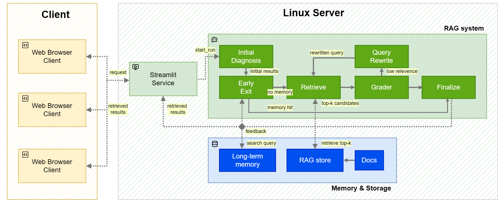

# Long-term Memory 결합형 Multi-Agent 기반 Multimodal RAG 시스템

> 과거 접근성 진단 이력을 멀티모달로 검색하고, 프로젝트 단위 Long-term Memory로 검증된 참조 이력을 축적해 진단 속도와 일관성을 함께 높인 Agentic RAG 시스템

## 1. 프로젝트 한눈에 보기

[As-Is]
접근성 진단 업무에서는 유사한 과거 진단 사례를 빠르게 찾고, 같은 프로젝트 안에서는 진단 기준과 표현을 일관되게 유지하는 것이 중요합니다. 
하지만 실제 현업에서는 과거 진단이력이 PPTX 형태로 흩어져 있어 유사 사례를 찾는 데 시간이 많이 들고, 
프로젝트 내 유사 오류에도 서로 다른 과거 진단이력을 참고해 진단 내용의 일관성을 유지하기 어렵다는 문제가 있었습니다.

[To-Be]
Multi-agent기반 Multimodal RAG를 통해 과거 진단이력 중 유사 내용을 호출하고, 
프로젝트 별 Long-term Memory를 통해 참고한 과거 진단이력을 기록하여, 유사 오류에 대한 진단 일관성을 유지했습니다.

### 프로젝트 메타 정보

| 항목 | 내용 |
|---|---|
| 프로젝트명 | Long-term Memory 결합형 Multi-Agent 기반 Multimodal RAG 시스템 |
| 근무부서 | AI 서비스 개발팀 |
| 기간 | 2026.01.05 ~ 2026.03.02 |
| 인원 | 1명 |
| 기여도 | 100% |
| 기술스택 | Python, PostgreSQL, LangGraph, Pydantic, Git |
| 역할 | Long-term Memory 설계 및 구현, Multi-Agent 기반 Multimodal RAG 파이프라인 구축, 품질 개선 루프 설계 |

### 핵심 성과

| 지표 | 결과 |
|---|---|
| 평균 탐색시간 | 수동 탐색 기준 평균 11.8분이 소요되던 탐색 시간을 평균 4.6분으로 단축했습니다. |
| Top-3 적중률 | 유사도 계산 방식별 성능을 비교한 결과, 텍스트 기반은 62%, 텍스트-이미지 결합 방식은 71%, 채널 분리 임베딩 방식은 84%를 기록 했습니다. |
| 유사도 계산 비교 | 텍스트 기반 62%, 텍스트-이미지 결합 71%, 채널 분리 임베딩 84% |
| Long-term Memory 재사용률 | 전체 진단 케이스 중 38%에서 저장된 과거 진단이력을 재활용해 유사 오류에 대한 진단 일관성을 높였습니다. |

---

## 2. 시스템은 어떻게 동작하는가



전체 파이프라인은 **현재 입력을 구조화하고, 검증된 과거 사례를 찾고, 그 결과를 다시 기억하는 흐름**으로 동작합니다.

1. 사용자가 웹 UI에서 **오류 이미지**와 **초기 진단 메모**를 입력합니다.
2. 시스템은 입력을 바탕으로 현재 사례의 `error_type`, `check_item`, `improvement_text`, `improvement_code`를 포함한 **1차 구조화 진단**을 생성합니다.
3. 생성된 현재 진단을 기준으로 프로젝트별 Long-term Memory를 먼저 검색합니다.
4. Long-term Memory 안에 충분히 유사한 승인 사례가 있으면 **early exit**로 해당 참조 결과를 바로 재사용합니다.
5. 적절한 memory가 없으면 Multimodal RAG가 과거 진단 문서에서 후보를 검색합니다.
6. grader가 검색 결과가 실제로 재사용 가능한지 평가하고, 부적합하면 query rewrite를 통해 질의를 보정한 뒤 재검색합니다.
7. 최종적으로 가장 적절한 참조 사례를 반환하고, 진단자가 `thumbs_up` 한 경우에만 그 연결 관계를 Long-term Memory에 저장합니다.

---

## 3. 왜 이런 설계를 선택했는가

이 프로젝트의 핵심 요구사항은 아래 두 가지였습니다.

- **과거 진단이력을 빠르게 찾는 것**
- **같은 프로젝트 안에서 진단 기준과 문구를 일관되게 유지하는 것**

기존 방식은 단순 top-k 검색만으로는 부족했습니다.  
유사한 사례를 찾는 문제와, 이미 검증된 참조 사례를 다시 활용하는 문제를 **함께** 다뤄야 했기 때문입니다.

### 3-1. 검색: 멀티모달 유사도 계산

접근성 진단은 문장 유사성보다 **화면 맥락**이 더 중요한 경우가 많습니다.  
그래서 텍스트와 이미지를 하나로 합치지 않고, **채널별로 분리해 임베딩한 뒤 weighted fusion으로 결합**했습니다.

**사용한 모델**
- **Image embedding**: `openai/clip-vit-base-patch32`
- **Text embedding**: `sentence-transformers/paraphrase-multilingual-MiniLM-L12-v2`

**조기 비교 단계 가중치**
- `text = 0.4`
- `image = 0.6`

즉, 이 프로젝트는 “문장이 비슷한가”보다  
**“실제 화면 구조와 오류 맥락이 비슷한가”**를 더 중요하게 보도록 설계했습니다.

### 3-2. 검색 제어: Agentic RAG 루프

벡터 유사도가 높다고 해서 바로 재사용할 수 있는 것은 아니었습니다.  
실무에서는 “비슷해 보이지만 실제로는 쓸 수 없는 사례”가 자주 나왔기 때문입니다.

그래서 검색은 단발성 retrieve가 아니라 아래 루프로 구성했습니다.

```text
initial diagnosis
→ retrieve
→ grade
→ rewrite
→ retrieve
```

**이 구조의 목적**
- 검색 결과가 실제로 의미 있는지 한 번 더 검증
- 부적합한 후보는 걸러내기
- 필요하면 query를 다시 써서 재검색하기

### 3-3. 오케스트레이션: LangGraph

이 시스템은 선형 체인보다 **조건 분기**가 훨씬 많습니다.

- memory early exit
- retrieval
- grader
- rewrite
- 재검색
- finalize
- feedback 저장

그래서 오케스트레이션은 **LangGraph**로 구현했습니다.  
그래프 기반 상태 전이를 사용하면 각 단계를 독립적으로 제어할 수 있고, 검색 실패·재검색·조기 종료 같은 흐름을 더 명확하게 다룰 수 있습니다.

### 3-4. 기억: PostgreSQL 기반 Long-term Memory

이 프로젝트에서 필요한 메모리는 채팅형 문맥 유지가 아니었습니다.  
핵심은 **프로젝트 단위 진단 일관성 확보를 위한 외부 메모리 레이어**였습니다.

그래서 mem0 같은 범용 인터페이스 대신,  
**LangGraph의 `PostgresStore`를 직접 사용하는 PostgreSQL 기반 Long-term Memory**를 사용했습니다.

**이렇게 설계한 이유**
- 프로젝트별 승인 이력을 명시적으로 저장할 수 있음
- 이후 요청에서 **조기 비교 단계의 빠른 재사용 레이어**로 활용 가능
- 같은 프로젝트 안에서 진단 기준과 표현을 더 일관되게 유지할 수 있음

---

## 4. Long-term Memory 설계

Long-term Memory의 저장 단위는 단순한 “과거 사례 1건”이 아닙니다.

> **현재 진단 사례가 어떤 과거 진단 사례를 참조했고, 그 참조가 승인되었는지**를 나타내는 연결 기록 1건

### 4-1. 저장 구조

```python
namespace = ("project_memory", project_id)
key = f"{past_case_id}:{current_case_id}"
value = {
    "current_diagnosis": {
        "error_type": "...",
        "check_item": "...",
        "improvement_text": "...",
        "improvement_code": "...",
        "image_path": "..."
    },
    "referenced_diagnosis": {
        "error_type": "...",
        "check_item": "...",
        "improvement_text": "...",
        "improvement_code": "...",
        "image_path": "..."
    }
}
```

### 4-2. 각 요소의 역할

- **namespace**
  - `("project_memory", project_id)`
  - 프로젝트 간 memory가 섞이지 않도록 분리

- **key**
  - `f"{past_case_id}:{current_case_id}"`
  - 같은 과거 사례가 여러 현재 사례에 참조되어도 충돌하지 않도록 구성

- **value**
  - `current_diagnosis`
  - `referenced_diagnosis`
  - 현재 진단과 실제로 활용된 과거 진단을 같은 스키마로 저장

### 4-3. 저장 정책

Long-term Memory에는 아무 결과나 저장하지 않았습니다.

- **진단자가 `thumbs_up` 한 경우만 저장**
- 즉, 실제로 활용 가치가 검증된 참조 결과만 누적

이 정책으로 memory 품질이 계속 유지되도록 했습니다.

### 4-4. 조기 비교 단계 (early exit)

Long-term Memory는 검색 초기에 먼저 확인합니다.

**입력**
- 지금 들어온 현재 진단 사례

**비교 대상**
- Long-term Memory 각 레코드의 `current_diagnosis`

**반환 대상**
- threshold를 넘긴 레코드의 `referenced_diagnosis`

즉 흐름은 아래와 같습니다.

```text
현재 입력 사례
→ memory.current_diagnosis 와 비교
→ 충분히 유사하면
→ memory.referenced_diagnosis 재사용
→ 상세 검색 생략
```

이 방식의 핵심은  
현재 입력과 “과거에 승인되었던 현재 사례 패턴”을 먼저 비교한 뒤, 매칭되면 그때 연결된 참조 사례를 바로 재사용하는 것입니다.

### 4-5. 유사도 계산 기준

**텍스트 비교 필드**
- `error_type`
- `check_item`
- `improvement_text`

**이미지 비교 필드**
- `image_path`

**제외 필드**
- `improvement_code`

`improvement_code`는 DOM 구조 차이로 노이즈가 커서 초기 버전의 유사도 계산에서는 제외했습니다.

### 4-6. 최종 점수 계산

- **text score**
- **image score**

를 각각 계산한 뒤 가중합으로 최종 점수를 만듭니다.

```text
final_score = 0.4 * text_score + 0.6 * image_score
```

### 4-7. Threshold

- `final_score >= 0.9`
  - Long-term Memory 바로 활용
- `final_score < 0.9`
  - Multimodal RAG 상세 검색으로 이동

---

## 5. 입력, 전처리, 출력

### 5-1. 입력

시스템 입력은 아래 세 가지입니다.

- 현재 진단할 **오류 이미지**
- 현재 상황에 대한 **초기 진단 메모**
- 프로젝트별 과거 진단 이력 문서 (`.pptx`, `.pdf`)

### 5-2. 전처리

과거 진단 문서는 전처리를 거쳐 아래 산출물로 변환됩니다.

- `cases.json`
- `vector_store.json`
- `manifest.json`
- `preprocessed/`

이 데이터를 기반으로 멀티모달 검색이 수행됩니다.

### 5-3. 출력

최종 출력은 아래 필드를 포함한 구조화 진단 결과입니다.

```json
{
  "error_type": "...",
  "check_item": "...",
  "improvement_text": "...",
  "improvement_code": "..."
}
```

정리하면:
- **입력**: 이미지, 진단 메모, 내부 참조 문서
- **출력**: 재사용 가능한 진단 결과와 참조 사례
- **축적**: 승인된 연결만 Long-term Memory에 저장

---

## 6. 이 프로젝트에서 얻은 점

이 프로젝트를 통해 확인한 점은 세 가지였습니다.

- 멀티모달 검색은 모델 교체보다 **어떤 신호에 더 큰 가중치를 둘지**가 성능에 직접적인 영향을 준다.
- RAG 품질은 retrieval 횟수보다 **언제 멈출지, 어떤 후보를 버릴지, 어떤 결과만 기억할지**를 잘 설계하는 것이 더 중요하다.
- 프로젝트 단위 Long-term Memory를 두면 잘 검증된 사례를 재사용해 **속도와 일관성**을 동시에 확보할 수 있다.

결국 이 프로젝트에서 성능을 좌우한 것은 단순 모델 선택보다도,
**workflow 설계, feedback 루프, 종료 조건, memory 저장 정책**이었습니다.

