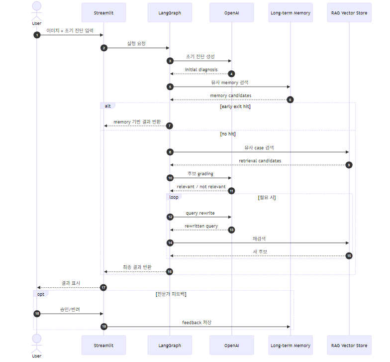

# Long-term Memory 결합형 Multi-Agent 기반 Multimodal RAG 시스템

> 과거 접근성 진단 이력을 멀티모달로 검색하고, 프로젝트 단위 Long-term Memory로 검증된 참조 이력을 축적해 진단 속도와 일관성을 함께 높인 Agentic RAG 시스템

## 1. 프로젝트 한눈에 보기

[As-Is]
접근성 진단 업무에서는 유사한 과거 진단 사례를 빠르게 찾고, 같은 프로젝트 안에서는 진단 기준과 표현을 일관되게 유지하는 것이 중요합니다. 
하지만 실제 현업에서는 과거 진단이력이 PPTX 형태로 흩어져 있어 유사 사례를 찾는 데 시간이 많이 들고, 
프로젝트 내 유사 오류에도 서로 다른 과거 진단이력을 참고해 진단 내용의 일관성을 유지하기 어렵다는 문제가 있었습니다.

[To-Be]
Multi-agent기반 Multimodal RAG를 통해 과거 진단이력 중 유사 내용을 호출하고, 
프로젝트 별 Long-term Memory를 통해 참고한 과거 진단이력을 기록하여, 유사 오류에 대한 진단 일관성을 유지했습니다.

### 프로젝트 메타 정보

| 항목 | 내용 |
|---|---|
| 프로젝트명 | Long-term Memory 결합형 Multi-Agent 기반 Multimodal RAG 시스템 |
| 근무부서 | AI 서비스 개발팀 |
| 기간 | 2026.01.05 ~ 2026.03.02 |
| 인원 | 1명 |
| 기여도 | 100% |
| 기술스택 | Python, PostgreSQL, LangGraph, Pydantic, Git |
| 역할 | Long-term Memory 설계 및 구현, Multi-Agent 기반 Multimodal RAG 파이프라인 구축, 품질 개선 루프 설계 |

### 핵심 성과

| 지표 | 결과 |
|---|---|
| 평균 탐색시간 | **61% 단축** (수동 탐색 평균 11.8분 → 4.6분) |
| Top-3 적중률 | **84% 달성** |
| 유사도 계산 비교 | 텍스트 기반 62%, 텍스트-이미지 결합 71%, 채널 분리 임베딩 84% |
| Long-term Memory 재사용률 | **38%** |

---

## 2. 시스템은 어떻게 동작하는가


전체 파이프라인은 **현재 입력을 구조화하고, 검증된 과거 사례를 찾고, 그 결과를 다시 기억하는 흐름**으로 동작합니다.

1. 사용자가 웹 UI에서 **오류 이미지**와 **초기 진단 메모**를 입력합니다.
2. 시스템은 입력을 바탕으로 현재 사례의 `error_type`, `check_item`, `improvement_text`, `improvement_code`를 포함한 **1차 구조화 진단**을 생성합니다.
3. 생성된 현재 진단을 기준으로 프로젝트별 Long-term Memory를 먼저 검색합니다.
4. Long-term Memory 안에 충분히 유사한 승인 사례가 있으면 **early exit**로 해당 참조 결과를 바로 재사용합니다.
5. 적절한 memory가 없으면 Multimodal RAG가 과거 진단 문서에서 후보를 검색합니다.
6. grader가 검색 결과가 실제로 재사용 가능한지 평가하고, 부적합하면 query rewrite를 통해 질의를 보정한 뒤 재검색합니다.
7. 최종적으로 가장 적절한 참조 사례를 반환하고, 진단자가 `thumbs_up` 한 경우에만 그 연결 관계를 Long-term Memory에 저장합니다.

즉 이 시스템은 단순 검색기가 아니라, **현재 사례를 구조화 → 빠른 memory 재사용 시도 → 실패 시 상세 검색 → 검증 → 승인 결과 축적**의 루프를 갖춘 Agentic RAG 파이프라인입니다.



---

## 3. 왜 이런 설계를 선택했는가

이 프로젝트의 핵심 요구사항은 두 가지였습니다. 첫째는 과거 진단이력을 빠르게 찾는 것이고, 둘째는 같은 프로젝트 내에서 진단 기준과 문구를 일관되게 유지하는 것입니다. 그래서 단순 top-k 검색만으로는 부족했고, 검색과 기억을 함께 다루는 구조가 필요했습니다.

먼저 검색 단계에서는 **텍스트와 이미지를 분리한 멀티모달 유사도 계산**을 사용했습니다. 접근성 진단은 문장 유사성보다 화면 맥락이 더 중요할 때가 많기 때문에, 텍스트와 이미지를 하나로 합치지 않고 채널별로 분리해 임베딩한 뒤 이미지에 더 높은 가중치를 주는 weighted fusion을 적용했습니다. 현재 구현은 이미지 임베딩에 `openai/clip-vit-base-patch32`, 텍스트 임베딩에 `sentence-transformers/paraphrase-multilingual-MiniLM-L12-v2`를 사용하고, 조기 비교 단계에서는 `text=0.4`, `image=0.6` 비율로 반영합니다.

다음으로 검색 제어는 **Agentic RAG 루프**로 구성했습니다. 실제 업무에서는 벡터 유사도가 높아도 바로 재사용하기 어려운 사례가 많기 때문에, `initial diagnosis → retrieve → grade → rewrite → retrieve` 흐름을 통해 검색 결과를 한 번 더 검증하도록 했습니다. 이 구조는 “비슷해 보이지만 실제로는 쓸 수 없는 사례”를 줄이는 데 목적이 있습니다.

이 흐름을 안정적으로 제어하기 위해 오케스트레이션은 **LangGraph**로 구현했습니다. 이 프로젝트는 memory early exit, retrieval, grader, rewrite, 재검색, finalize, feedback 저장처럼 조건 분기가 많아서 선형 체인보다 그래프 기반 상태 전이가 더 적합했습니다.

마지막으로, 이 프로젝트에서 중요한 메모리는 채팅형 문맥 유지가 아니라 **프로젝트 단위 진단 일관성 확보를 위한 외부 메모리 레이어**였습니다. 그래서 mem0 같은 범용 인터페이스 대신 **LangGraph의 PostgresStore를 직접 사용하는 PostgreSQL 기반 Long-term Memory**로 구성했습니다. 이렇게 하면 프로젝트별로 승인된 참조 이력을 명시적으로 저장하고, 이후 요청에서 조기 비교 단계의 빠른 재사용 레이어로 활용할 수 있습니다.

---

## 4. Long-term Memory 설계

Long-term Memory의 저장 단위는 “과거 사례 1건”이 아니라, **현재 진단 사례가 어떤 과거 진단 사례를 참조했고 그 참조가 승인되었는지**를 나타내는 연결 기록 1건입니다. 따라서 저장 구조는 프로젝트별 namespace 아래에, `past_case_id`와 `current_case_id`를 결합한 key를 두고, 현재 진단과 참조된 과거 진단을 동일한 포맷의 JSON으로 저장합니다.

```python
namespace = ("project_memory", project_id)
key = f"{past_case_id}:{current_case_id}"
value = {
    "current_diagnosis": {
        "error_type": "...",
        "check_item": "...",
        "improvement_text": "...",
        "improvement_code": "...",
        "image_path": "..."
    },
    "referenced_diagnosis": {
        "error_type": "...",
        "check_item": "...",
        "improvement_text": "...",
        "improvement_code": "...",
        "image_path": "..."
    }
}
```

이 설계의 의도는 명확합니다. `namespace`는 프로젝트 간 memory가 섞이지 않도록 분리하고, `key`는 같은 과거 사례가 여러 현재 사례에 참조되어도 충돌하지 않게 합니다. `value`에는 현재 진단과 실제로 활용된 과거 진단을 같은 스키마로 저장해 이후 유사도 비교와 재사용을 쉽게 만듭니다. 저장 정책은 단순합니다. **진단자가 `thumbs_up` 한 경우만 Long-term Memory에 반영**합니다.

검색은 조기 비교 단계에서 먼저 수행됩니다. 입력으로 지금 들어온 현재 진단 사례를 받고, Long-term Memory 각 레코드의 `current_diagnosis`와 비교합니다. 여기서 충분히 유사한 memory가 있으면 그 레코드의 `referenced_diagnosis`를 바로 반환하고 상세 검색을 생략합니다. 즉, 현재 입력과 “과거에 승인되었던 현재 사례 패턴”을 먼저 비교한 뒤, 매칭되면 거기에 연결된 참조 사례를 재사용하는 방식입니다.

유사도 계산은 텍스트와 이미지를 분리해 수행합니다. 텍스트 비교에는 `error_type`, `check_item`, `improvement_text`를 사용하고, 이미지 비교에는 `image_path`를 사용합니다. `improvement_code`는 DOM 구조 차이로 노이즈가 커서 초기 버전의 유사도 계산에서는 제외했습니다. 최종 점수는 텍스트와 이미지 유사도를 가중합으로 계산하며, threshold는 **0.9**로 고정했습니다. 따라서 `final_score >= 0.9`이면 Long-term Memory를 바로 활용하고, 그보다 낮으면 Multimodal RAG 상세 검색으로 넘어갑니다.

---

## 5. 입력, 전처리, 출력

시스템 입력은 현재 진단할 **오류 이미지**, 현재 상황에 대한 **초기 진단 메모**, 그리고 프로젝트별 과거 진단 이력 문서(`.pptx`, `.pdf`)입니다. 과거 진단 문서는 전처리를 거쳐 프로젝트별 `cases.json`, `vector_store.json`, `manifest.json`, `preprocessed/` 산출물로 변환되며, 이 데이터를 기반으로 멀티모달 검색이 수행됩니다.

최종 출력은 아래 필드를 포함한 구조화 진단 결과입니다.

```json
{
  "error_type": "...",
  "check_item": "...",
  "improvement_text": "...",
  "improvement_code": "..."
}
```

즉 입력은 이미지와 진단 메모, 내부 참조 문서이고, 출력은 재사용 가능한 진단 결과와 참조 사례이며, 그중 승인된 연결만 Long-term Memory로 다시 축적됩니다.

---

## 6. 이 프로젝트에서 얻은 점

이 프로젝트를 통해 멀티모달 검색은 모델을 바꾸는 것보다 **어떤 신호에 더 큰 가중치를 둘지**가 성능에 직접적인 영향을 준다는 점을 확인했습니다. 또한 RAG 품질은 retrieval을 많이 반복하는 것보다 **언제 멈출지, 어떤 후보를 버릴지, 어떤 결과만 기억할지**를 잘 설계하는 것이 더 중요했습니다. 특히 프로젝트 단위 Long-term Memory를 두면 잘 검증된 사례를 재사용해 **속도와 일관성**을 동시에 확보할 수 있었고, 검색 품질은 모델 교체보다도 workflow 설계와 feedback 루프, 종료 조건 관리에 크게 좌우된다는 점을 확인했습니다.

---

## 7. 참고

- 자세한 실행 보조 문서는 `README_COLAB_RUN.md`를 참고하세요.
- 예제 입력은 `example_input/`에 포함되어 있습니다.
- 포트폴리오용 설명 자료와 함께 보면 설계 의도를 더 쉽게 이해할 수 있습니다.
